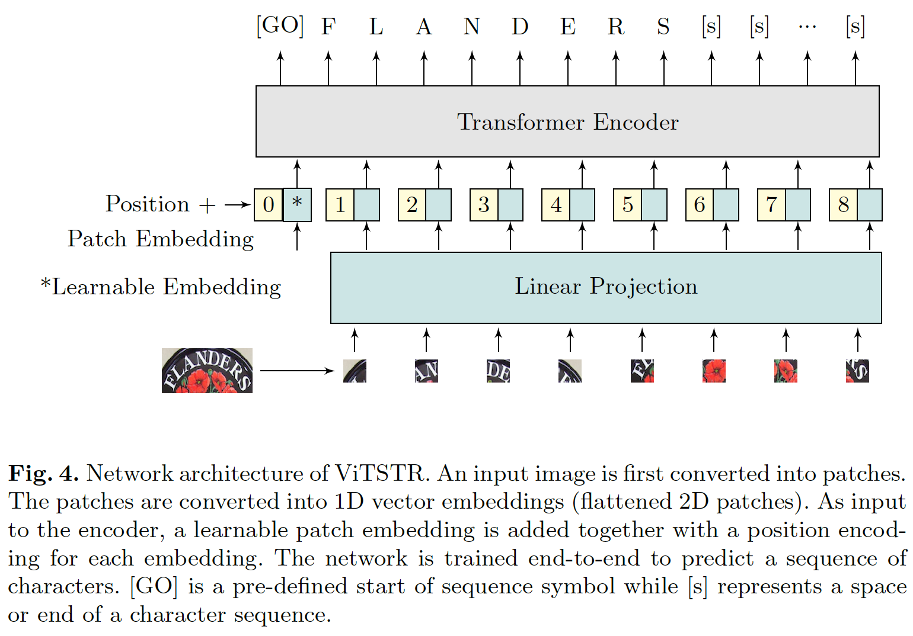
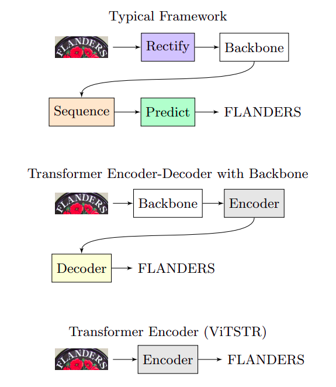

# Text Recognition with ViTSTR

## Introduction
This is a mini-project of implementing Text Recognition task using ViTSTR (Vision Transformer for Scene Text Recognition). The method is inspired by [this](https://github.com/roatienza/deep-text-recognition-benchmark/blob/master/infer.py) public repository created by [roatienza](https://github.com/roatienza) that built using a fork of [CLOVA AI Deep Text Recognition Benchmark](https://github.com/clovaai/deep-text-recognition-benchmark). This project also based on [Vision Transformer for Fast and Efficient Scene Text Recognition](https://arxiv.org/abs/2105.08582) paper.

ViTSTR is a simple single-stage model that uses a pre-trained Vision Transformer (ViT) to perform Scene Text Recognition (ViTSTR). It has a comparable accuracy with state-of-the-art STR models although it uses significantly less number of parameters and FLOPS. ViTSTR is also fast due to the parallel computation inherent to ViT architecture.



The main advantage by using ViTSTR for text recognition is the simplicity and the efficiency. Instead of using general method (four-steps, three-steps) to do text recognition task, ViTSTR only using one stage (Transformer Encoder) to performs. We can see the comparison in the figure below.



## Tutorial

Clone the project

```bash
git clone https://github.com/zogojogo/text-recognition-wii.git
```

Go to the project directory

```bash
cd text-recognition-wii
```

Download Dependencies
```bash
pip install -r requirements.txt
```

Start API service

```
python3 app.py
```
  
## API Reference

Service: http://your-ip-address:8080

#### POST image

```http
  POST /segment_lung
```
Content-Type: multipart/form-data
| Name    | Type   | Description                                         |
| :------ | :----- | :-------------------------------------------------- |
| `image` | `file` | **Required**. `image/png` or `image/jpg` MIME Type |

## Output Example

**Output:**<br>
```python
{
  "filename": "<filename>",
  "contentype": "<image type>",
  "output text": "<predicted text>",
  "inference time": "<inference time>"
}
```